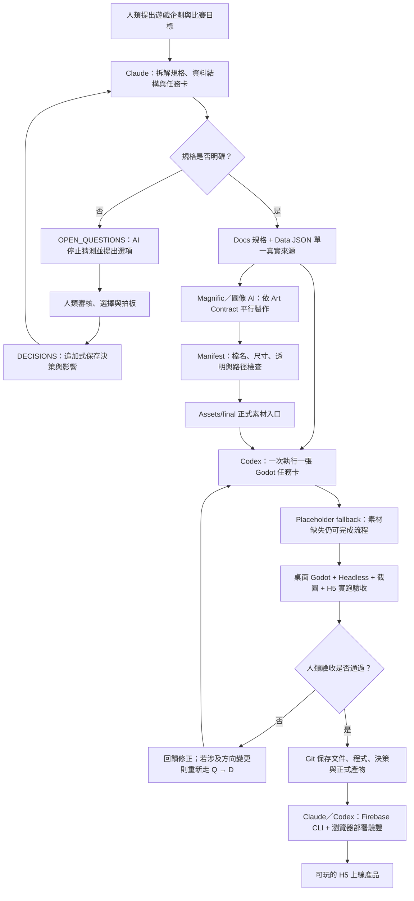

# 比賽繳交文件：AI 工具使用清單與 AI 開發工作流程

> 文件狀態：2026-07-15 補登版  
> 紀錄方式：由 AI 依專案文件、Git、任務卡、決策與驗收紀錄協助彙整；參賽者已實際執行遊戲驗證，並對最終內容負責。  
> 統計口徑：Git 數據以 2026-07-15 的 `HEAD`（`c909327`）為準；任務卡與決策數量以同日工作區文件為準。

## 一、專案與 AI 應用摘要

本作品是 Godot 4.6 製作的手機直式 9:16 H5 遊戲。開發目標不只是完成一款遊戲，而是建立一套可複製的 AI 遊戲開發生產線：

> 人類決定方向，AI 負責結構化規劃與實作；每一步都有文件、邊界、決策紀錄與驗收依據。

專案以 repo 文件作為不同人員與 AI 工具之間的共同介面，將企劃、規格、資料、任務卡、程式、美術合約、決策與驗收拆開管理，降低只依賴聊天上下文造成的遺忘、誤解及方向漂移。

截至本文件統計日，專案紀錄包括：

| 項目 | 數量／狀態 | 口徑 |
|---|---:|---|
| Git commits | 122 | 截至 `c909327` |
| Codex 任務卡 | 27 張 | `Codex/01`–`27`，均已有 Git 紀錄 |
| 人類決策 | 25 筆 | `D-001`–`D-025` |
| AI 不確定事項 | 12 筆 | 一般問題 7 筆、美術問題 5 筆，均已標示 ANSWERED |
| JSON 設定檔 | 7 份 | 數值、文案、音訊、動畫等單一真實來源 |
| 已提交 GDScript | 36 份、約 5,552 行 | 以 Git 追蹤檔案之非空白行計算（含空白行為 6,810 行） |
| 文件紀錄期間 | 2026-06-27 起 | 依 Git 最早紀錄；為下班時間持續迭代專案 |

## 二、AI 工具使用清單

### 1. Claude／Claude Code

| 項目 | 內容 |
|---|---|
| 使用模型 | Claude Sonnet 4.6、Sonnet 5.0、Fable 5（依開發期間陸續使用） |
| 主要角色 | 企劃拆解、系統規格、資料結構、治理文件、決策選項與任務卡規劃 |
| 實際用途 | 將企劃轉為 `Docs/` 規格與 `Data/*.json`；整理 `OPEN_QUESTIONS` 選項；依人類裁示寫入 `DECISIONS`；規劃 Codex 任務卡 |
| 雲端用途 | 透過 Firebase CLI 與瀏覽器協助完成 Auth、Firestore、Hosting 佈建及 Godot/Web 橋接；登入與憑證由人類親手操作 |
| 人類把關 | 核心玩法、功能範圍、雲端權限、美術規格變更與新系統是否啟用均由人類拍板 |
| 代表證據 | `Planning/01_AI_WORKFLOW_STRATEGY.md`、`CLAUDE.md`、`Docs/DECISIONS.md`、`Firebase/README.md`、任務 12/13/17 |

### 2. OpenAI Codex

| 項目 | 內容 |
|---|---|
| 使用模型 | GPT-5.5、GPT-5.6-SOL（依開發期間陸續使用） |
| 主要角色 | Godot 4 實作工程師與驗收協作者 |
| 實際用途 | 建立 Godot 專案骨架、GDScript 分層、狀態機、下注與戰鬥循環、UI、動畫、特效、音訊服務、排行榜、素材接入與 H5 相容處理 |
| 工作方式 | 開工前讀 `AGENTS.md`、規格、資料與當前任務卡；一次執行一張卡；遇到不確定事項停止猜測並寫入 `OPEN_QUESTIONS` |
| 驗收用途 | Godot 桌面實跑、headless 測試、JSON 驗證、狀態驅動截圖、H5 匯出與瀏覽器實跑、fallback 與破壞性測試 |
| 人類把關 | 人類檢視實際遊戲畫面、手感、文案與版面，提出修正並完成最終驗收；本文件亦由 Codex 代為補登既有驗證事實 |
| 代表證據 | `AGENTS.md`、`Codex/01`–`27`、`Codex/VALIDATION_CHECKLIST.md`、`Scripts/`、`Scenes/` |

### 3. GPT Image-2 ＋ Magnific（美術生成管線）

| 項目 | 內容 |
|---|---|
| 主要角色 | AI 美術強化、重繪與風格統一 |
| 底圖來源 | 以 GPT Image-2 生成底圖，再經 Magnific 強化與風格統一 |
| 實際用途 | 依 Art Contract、素材規格與 prompt 樣板處理角色、怪物、背景及部分 UI 美術；完成後依 manifest 命名並放入 `Assets/final/` |
| 協作方式 | 工程先用 placeholder 完成可玩閉環，美術同步製作正式素材；候選稿不作為程式依賴，正式檔案到位後再接入 |
| 人類把關 | 美術方向與可用素材由人類／美術同事決定；規格不符時走 Q-ART → DECISIONS → Contract 升版流程 |
| 代表證據 | `Art/ARTIST_QUICKSTART.md`、`Art/ART_CONTRACT.md`、`Art/prompts/magnific_prompts.md`、`Assets/ART_ASSET_MANIFEST.md` |

### 4. Codex ＋ agent-sprite-forge（圖像生成 skill）

| 項目 | 內容 |
|---|---|
| 工具來源 | 開源 Codex skill：<https://github.com/0x0funky/agent-sprite-forge>（AI 圖像生成＋本機後處理腳本，輸出遊戲可直接接入的素材） |
| 專案定位 | 開發早期以 Codex 搭配此 skill 生成測試素材驗證可行性，效果良好；正式美術後續改採 GPT Image-2 ＋ Magnific 管線（見上節），此 skill 保留用於 UI 貼紙與暫代素材 |
| 主要角色 | 產生適合遊戲接入的 UI 貼紙、icon、9-slice 皮膚與特定活動圖像暫代素材 |
| 實際用途 | 任務 10 的 UI 皮膚與 icon、任務 22 的金色數字貼紙、任務 24 的虎爺事件暫代圖 |
| 後處理 | 透明背景處理、切圖、縮放、runtime 尺寸輸出、Godot 匯入與 fallback 驗證 |
| 人類把關 | 生成圖只在任務卡與 Art Contract 允許的類別中使用；人類提供或確認視覺方向，正式設計稿可覆蓋同檔名素材 |
| 代表證據 | `Codex/10_UI_SKIN_ALIGNMENT.md`、`Codex/22_WIN_BANNER_INTERSTITIAL.md`、`Codex/24_HUYE_RESCUE_EVENT.md`、`Artifacts/ui_sprite_skin/` |

### 5. Suno AI

| 項目 | 內容 |
|---|---|
| 主要角色 | 遊戲 BGM 生成 |
| 實際用途 | 生成主遊戲 BGM（`bgm_main.mp3`，已接入），依 `Data/audio.json` 資料驅動播放；虎爺事件 BGM（`bgm_huye.ogg`）已登記於資料檔、檔案待補（缺檔時 fallback 靜音） |
| 人類把關 | 曲風方向與採用與否由參賽者試聽決定；音效（SFX）不使用 AI，取自免費素材庫 |
| 代表證據 | `Data/audio.json`、`Docs/SFX_PRODUCTION_LIST.md`、`Assets/final/audio/` |

> 補充：repo 未逐一保存各 AI 服務當時的模型版本與每張底圖的產生紀錄；上列模型版本（Sonnet 4.6／5.0、Fable 5、GPT-5.5、GPT-5.6-SOL）與底圖來源（GPT Image-2）由參賽者依實際使用情況補登，其餘內容以文件可驗證的紀錄為準。

## 三、配合使用的非 AI 工具

| 工具 | 用途 |
|---|---|
| Godot 4.6 | 遊戲引擎、桌面實跑、headless 測試與 Web 匯出 |
| Git | 保存規格、決策、任務卡、程式與正式產物的變更軌跡 |
| Firebase CLI／Console | Google 登入、Firestore、排行榜與 Hosting 佈建部署 |
| 瀏覽器與 DevTools | H5 實機測試、OAuth popup、雲端資料與 console 驗證 |
| JSON | 遊戲平衡、文案、怪物、動畫、音訊與排行榜 mock 的資料驅動設定 |
| 圖像後處理工具 | 去背、裁切、縮放、序列圖與 runtime 圖檔整理 |
| 免費音效素材庫 | 遊戲 SFX 來源（非 AI 生成；BGM 為 Suno AI，見上節） |

## 四、AI 開發工作流程圖

## 五、每張任務卡的標準閉環

1. 閱讀 `AGENTS.md`、必要規格與最新決策。
2. 只執行當前一張任務卡，確認「要做／不做／驗收」邊界。
3. 從 `Data/*.json` 讀取數值與文案，不散落寫死在程式中。
4. 遇到需求不明確時寫入 `OPEN_QUESTIONS`，等待人類回答。
5. 依任務卡修改 Godot 程式、場景、資料或素材接點。
6. 執行語法、資料、桌面遊戲、版面截圖、H5 與 fallback 驗證。
7. 人類實際檢視遊戲效果並提出修正或確認通過。
8. 以 Git 保存變更，使下一個 AI session 不依賴前一次聊天記憶。

## 六、人類與 AI 的責任界線

### 人類負責

- 決定核心玩法、產品方向與比賽呈現重點。
- 審核 AI 提出的選項，將定案寫入或確認寫入 `DECISIONS`。
- 決定是否新增線上服務、排行榜、音訊與事件等功能。
- 決定美術風格、採用哪些正式素材及何時升版 Art Contract。
- 實際操作敏感登入與憑證流程。
- 實際遊玩並驗證畫面、手感、文案、音效及完成度。

### AI 負責

- 將企劃轉換成可執行的規格、資料結構與任務卡。
- 提出選項、風險、影響範圍與建議，不代替人類拍板。
- 依已確認文件實作 Godot、Web 與 Firebase 接點。
- 產生或整理符合合約的部分美術與 UI 素材。
- 執行自動測試、截圖、資料驗證與文件補登。

## 七、代表性治理案例

### 案例 A：AI 不擅自新增後端

Google 登入與雲端分數原本超出 MVP 範圍。AI 先建立 Q-005，整理 Firebase 方案、fallback、權限與安全界線；人類決定採用後形成 D-015，再拆成雲端佈建、Godot 串接與登入 UI 任務卡。這證明 AI 沒有直接越過產品範圍，而是透過人類決策後才執行。

### 案例 B：美術交付與規格不一致時不硬改

怪物序列圖、sprite sheet 尺寸與 JPG 背景曾與舊版 Art Contract 不一致。專案以 Q-ART 提案、影響評估、人類裁示及 Contract 升版處理，保留舊決策歷史，而不是讓 AI 為了接檔偷偷改規格。

### 案例 C：正式素材未完成也不阻塞工程

工程先使用 `Assets/placeholders/` 建立完整遊戲循環，美術平行產製正式素材；程式只依賴 `final/` 與 placeholder，缺檔時自動 fallback。這讓一人利用下班時間開發時，程式、美術與雲端工作不必互相等待。

## 八、Repo 證據索引

| 想查看的內容 | 文件／路徑 |
|---|---|
| AI 工作流策略 | `Planning/01_AI_WORKFLOW_STRATEGY.md` |
| 人類決策格式 | `Planning/02_HUMAN_DECISION_RECORD.md` |
| AI 協作鐵則 | `AGENTS.md` |
| AI 不確定事項 | `Docs/OPEN_QUESTIONS.md` |
| 人類定案紀錄 | `Docs/DECISIONS.md` |
| 規格與資料 | `Docs/01`–`08`、`Data/*.json` |
| Codex 任務卡 | `Codex/01`–`27` |
| 驗收規則 | `Codex/VALIDATION_CHECKLIST.md` |
| 美術規格與交付 | `Art/ART_CONTRACT.md`、`Assets/ART_ASSET_MANIFEST.md` |
| Git 協作 | `Planning/06_GIT_COLLABORATION_WORKFLOW.md` |
| Firebase 操作紀錄 | `Firebase/README.md` |
| 實作產物 | `Scripts/`、`Scenes/`、`Assets/final/` |

## 九、繳交聲明

本專案由參賽者利用下班時間主導開發，AI 工具用於規劃、程式、美術協作、雲端操作、驗證與文件整理。遊戲方向、功能取捨、帳號授權、美術採用及最終驗收均由參賽者負責。本文件是依已發生且已由參賽者驗證的專案紀錄補登，並未將未執行的工作寫成完成事項。
