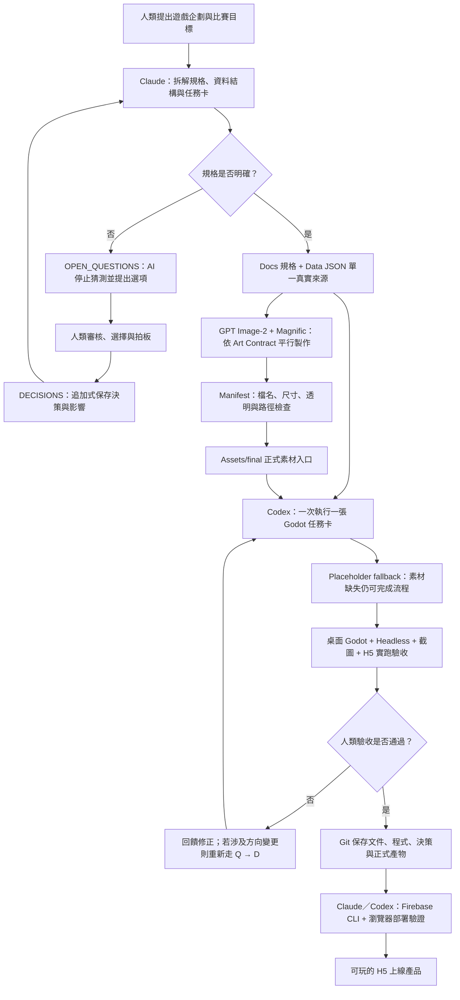
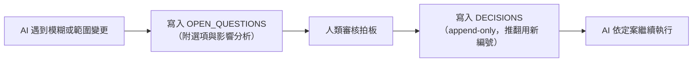
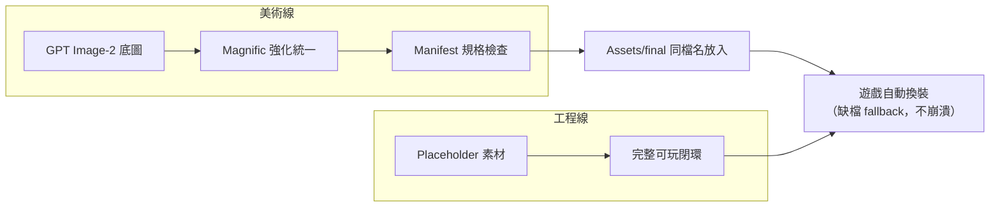

# PPT 草稿二：AI 工作流程圖

> 用途：比賽繳交 PPT「AI 工作流程圖」的內容底稿。每個 `## Slide N` 為一頁投影片。
> 流程圖以 mermaid 表達邏輯，最終 PPT 可照結構重繪成圖形（節點文字照抄即可）。
> 事實來源：`Planning/08_COMPETITION_AI_USAGE_AND_WORKFLOW.md`（已逐項對 repo 查證）。
> 狀態：草稿 v1（2026-07-15），待參賽者審核。

---

## Slide 1：封面

- 標題：**AI 開發工作流程**
- 副標：CrushGameDemo — 一套可複製的 AI 遊戲開發生產線
- 核心命題：**每一步都有文件、邊界、決策紀錄與驗收依據**

> 講者備註：目標不只是完成一款遊戲，而是驗證「一人＋多個 AI」能以工程化流程穩定出貨。

---

## Slide 2：核心設計 — 用 repo 文件取代聊天記憶

- 問題：只靠聊天上下文協作 AI → 遺忘、誤解、方向漂移
- 解法：**repo 文件是人類與所有 AI 工具的共同介面**

| 文件 | 角色 |
|---|---|
| `AGENTS.md` | AI 行為鐵則（最高準則） |
| `Docs/` 規格＋`Data/*.json` | 單一真實來源，禁止寫死 |
| `OPEN_QUESTIONS.md` | AI 不確定 → 停下提問 |
| `DECISIONS.md` | 人類拍板，append-only 不可竄改 |
| `Codex/` 任務卡 | 一次一張，邊界明確 |
| Git | 每步可追溯，session 間不依賴記憶 |

---

## Slide 3：全流程圖（主圖）

> 講者備註／PPT 重繪建議：三個泳道上色區分——人類（決策節點 A/E/N）、
> Claude（規劃 B/D/F）、Codex＋美術 AI（執行 G–M）。兩個菱形是人類把關點。

---

## Slide 4：關鍵機制一 — AI 不確定就停（Q → D 迴圈）

- 實績：**12 筆提問全數經人類裁示後才動工，0 筆 AI 擅自猜測**
- 案例：Google 登入超出 MVP 範圍 → AI 先提 Q-005 整理方案與風險 → 人類定案 D-015 → 才拆卡實作

---

## Slide 5：關鍵機制二 — 每張任務卡的標準閉環

1. 讀 `AGENTS.md`、規格與最新決策
2. 只做當前一張卡，確認「要做／不做／驗收」邊界
3. 數值文案一律讀 `Data/*.json`，不寫死
4. 不明確 → 寫 Q 等人類，不猜
5. 依卡修改程式、場景、資料或素材接點
6. 自動驗證：語法、資料、桌面實跑、截圖、H5、fallback
7. **人類實際遊玩驗收**，提修正或確認通過
8. Git 保存 → 下個 AI session 不依賴前次聊天記憶

- 實績：**27 張卡片全數走完此閉環，各有 Git 紀錄**

---

## Slide 6：關鍵機制三 — 工程與美術平行、互不阻塞

- 程式只認 `final/` 與 placeholder 兩個入口，正式圖到位即自動生效
- 美術規格衝突不硬改：走 Q-ART 提案 → 人類裁示 → Contract 升版（v1.0 → v1.5）

---

## Slide 7：人類與 AI 的責任界線

| 人類負責 | AI 負責 |
|---|---|
| 核心玩法與產品方向 | 企劃 → 規格、資料結構、任務卡 |
| 審核選項、寫入定案 | 提選項與風險，不代替拍板 |
| 是否啟用新功能／新服務 | 依已確認文件實作 |
| 美術風格與素材採用 | 產出符合合約的素材 |
| 敏感登入與憑證親手操作 | 自動測試、截圖、資料驗證 |
| 實際遊玩最終驗收 | 文件補登與紀錄整理 |

- 一句話：**AI 提供槓桿，人類保有方向盤與煞車**

---

## Slide 8：成果 — 流程跑出來的東西

- 27 張任務卡 → **完整 H5 遊戲上線**（Google 登入＋Firebase 雲端排行榜）
- 122 commits、25 筆決策、12 筆 Q 全數裁示——**全程可追溯、可查核**
- 一人下班時間、約三週完成，流程可複製到下一個專案
- https://crushgamedemo-bloop.web.app

---

## 待參賽者確認的開放項（不上投影片）

1. 主流程圖（Slide 3）節點較多，若簡報時間短，可只留主幹
   （企劃 → 規劃 → Q/D 把關 → 任務卡實作 → 人類驗收 → 上線）約 8 節點版本，要嗎？
2. 關鍵機制三頁（Slide 4–6）若有頁數限制，優先保留哪一個？
   （建議保 Slide 4「不確定就停」——最能打「AI 應用 40%」評分項）
3. Slide 8 的「約三週」是 06-27 → 07-15 的推算，實際投入時段以你說法為準。
